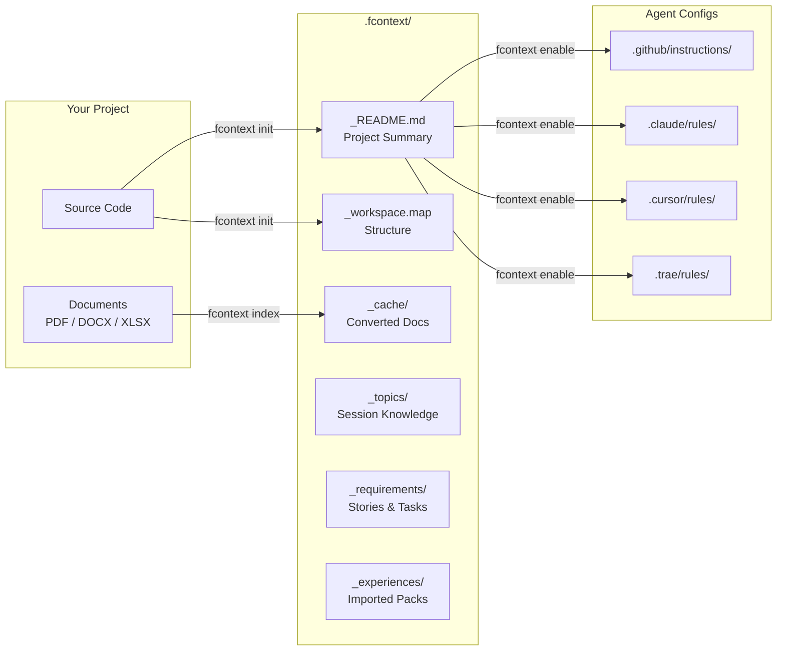
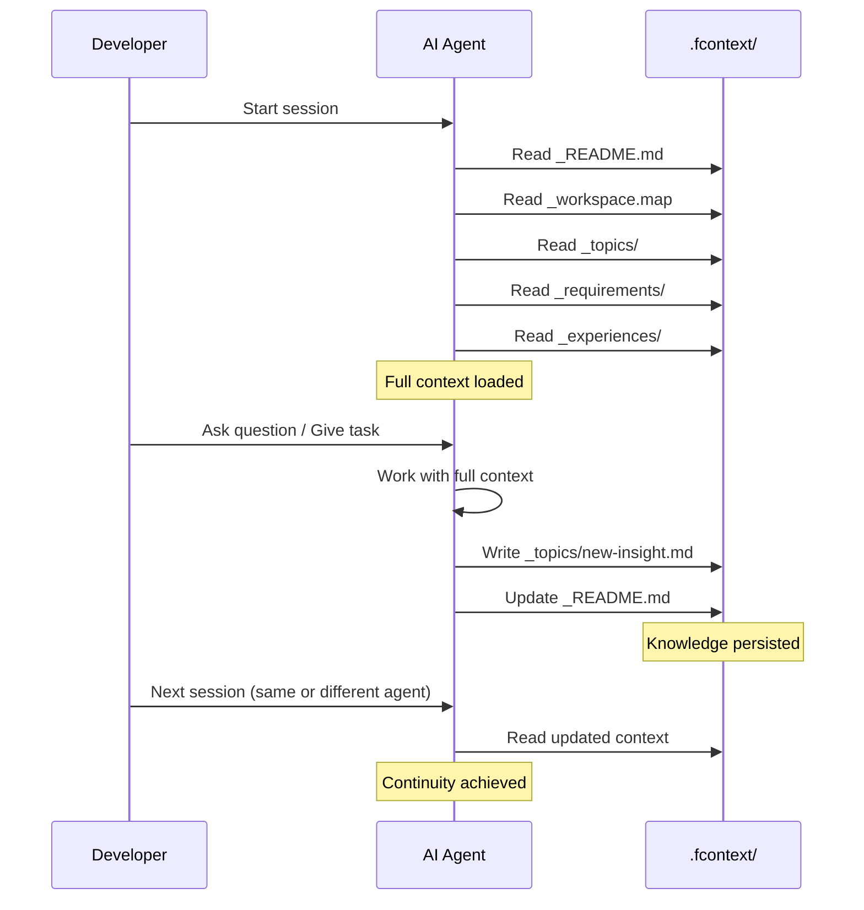
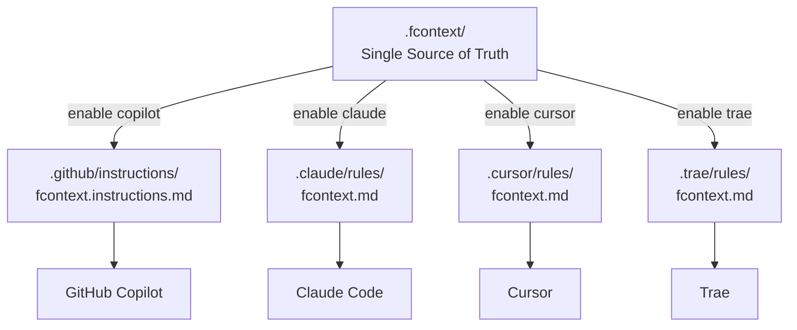

# Architecture

## How fcontext Works

fcontext operates on one principle: **structured local files that AI agents already know how to read**.



---

## Directory Structure

```
.fcontext/
├── _README.md            # Living project summary (AI-maintained)
├── _workspace.map        # Auto-generated project structure
├── _cache/               # Binary → Markdown conversions
│   ├── specs/
│   │   └── requirements.pdf.md
│   └── docs/
│       └── architecture.docx.md
├── _topics/              # Session-accumulated knowledge
│   ├── auth-analysis.md
│   └── deploy-notes.md
├── _requirements/        # Structured requirement tracking
│   ├── STORY-001.yaml
│   └── TASK-001.yaml
└── _experiences/         # Imported knowledge packs (read-only)
    └── domain-knowledge/
        ├── _README.md
        ├── _cache/
        └── _topics/
```

---

## Data Flow

### Session Lifecycle



### Multi-Agent Configuration

When you run `fcontext enable <agent>`, the tool generates agent-specific instruction files that point back to `.fcontext/`:



Each instruction file contains:

1. **Workflow rules** — when to read/write `.fcontext/` data
2. **Anti-pattern rules** — what NOT to do (e.g., never modify `_experiences/`)
3. **Command reference** — available `fcontext` CLI commands

The instructions are **generated, not copied**. Each agent gets rules formatted for its own instruction system.

---

## Design Principles

| Principle | Implementation |
|-----------|----------------|
| **Files over APIs** | All context is plain Markdown/YAML files |
| **Convention over configuration** | Fixed directory structure, no config needed |
| **Agent-agnostic** | Shared data, agent-specific instruction generation |
| **Additive knowledge** | Topics accumulate, nothing is auto-deleted |
| **Read-only imports** | Experience packs are immutable once imported |
| **Local-first** | No network required for core functionality |
