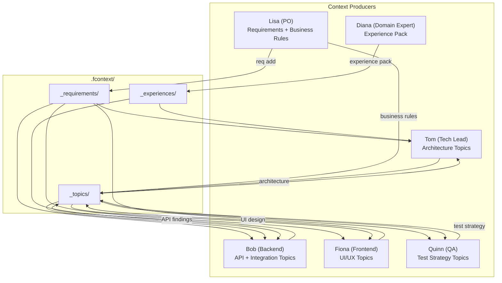
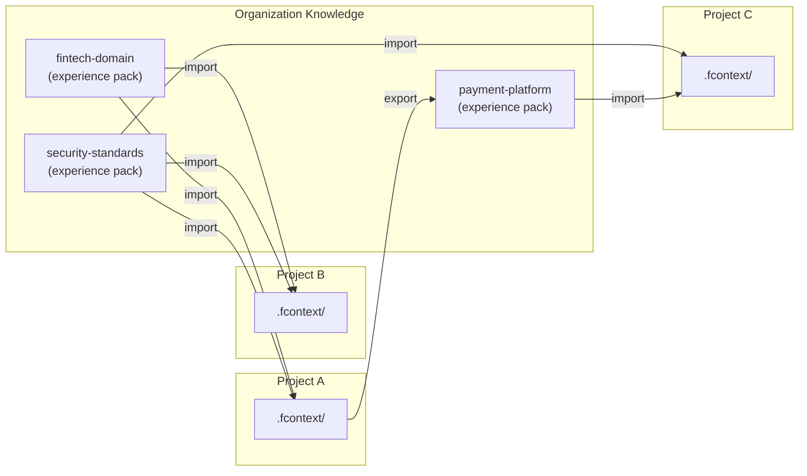

# Demo: Enterprise Context Network

> A team of 6 people builds a fintech product. Each role produces and consumes different context. The tech lead aggregates everyone's context into a unified view. Together, they form an enterprise context network.

---

## The Team

| Role | Person | Produces | Consumes |
|------|--------|----------|----------|
| Product Owner | Lisa | Requirements, user stories | Architecture decisions, tech constraints |
| Tech Lead | Tom | Architecture topics, experience packs | Everyone's context |
| Backend Dev | Bob | API design topics, debugging findings | Requirements, architecture, domain knowledge |
| Frontend Dev | Fiona | UI/UX topics, component patterns | API specs, requirements |
| QA Engineer | Quinn | Test strategy topics, bug reports | Requirements, architecture, API specs |
| Domain Expert | Diana | Domain experience pack | Implementation topics (for validation) |

---

## Setup

Every team member initializes fcontext in the **same shared repo**:

```bash
git clone git@github.com:fintech-co/payment-platform.git
cd payment-platform
fcontext enable copilot   # or their preferred agent
```

The domain expert creates and publishes the domain knowledge pack:

```bash
# Diana maintains a separate domain knowledge repo
cd fintech-domain-knowledge
fcontext init
# ... curate domain topics, index regulations, write patterns ...
fcontext export git@github.com:fintech-co/fintech-domain.git
```

The team imports it:

```bash
cd payment-platform
fcontext experience import git@github.com:fintech-co/fintech-domain.git
```

---

## Day 1 — Lisa Defines Requirements

Lisa adds structured requirements:

```bash
fcontext req add "Real-time payment processing" -t epic
fcontext req add "Payment initiation API" -t story --parent EPIC-001
fcontext req add "Transaction monitoring dashboard" -t story --parent EPIC-001
fcontext req add "Compliance reporting" -t story --parent EPIC-001
```

Her AI also writes a topic capturing business context:

```
.fcontext/_topics/
  payment-processing-business-rules.md
  # Contains: settlement windows, currency rules, 
  # risk thresholds, regulatory constraints
```

She commits and pushes.

## Day 2 — Tom Designs Architecture

Tom pulls Lisa's changes. His AI reads:

- `_requirements/` — the full epic and stories
- `_topics/payment-processing-business-rules.md` — Lisa's business context
- `_experiences/fintech-domain/` — Diana's domain knowledge

With all this context, Tom's AI helps him design the architecture. His AI writes:

```
.fcontext/_topics/
  architecture-payment-pipeline.md
  # Contains: event-driven architecture, CQRS for transactions,
  # saga pattern for multi-step payments, idempotency strategy
```

He commits and pushes.

## Day 3 — Bob & Fiona Implement

**Bob** pulls. His AI reads Lisa's requirements + Tom's architecture + Diana's domain knowledge:

```
Bob's AI context:
├── _requirements/STORY-001.yaml    ← what to build
├── _topics/architecture-*.md       ← how to build it
├── _topics/payment-business-*.md   ← business rules
└── _experiences/fintech-domain/    ← industry patterns
```

Bob implements the Payment API. His AI writes:

```
.fcontext/_topics/
  api-idempotency-implementation.md
  stripe-integration-gotchas.md
```

**Fiona** pulls the same context + Bob's new API topics. She builds the dashboard knowing the exact API contract and data model. Her AI writes:

```
.fcontext/_topics/
  dashboard-realtime-websocket-design.md
```

## Day 4 — Quinn Tests

Quinn pulls **everyone's** topics. His AI understands:

- What the feature does (Lisa's requirements)
- How it's built (Tom's architecture)
- API edge cases (Bob's implementation topics)
- UI interaction flows (Fiona's dashboard topics)
- Domain constraints (Diana's experience pack)

Quinn's AI generates a test strategy that covers all dimensions — not just functional tests, but compliance edge cases, concurrency scenarios, and UI state transitions.

```
.fcontext/_topics/
  test-strategy-payment-pipeline.md
```

---

## The Context Network



---

## Tom Aggregates — The Leader's View

As tech lead, Tom reads **all** context:

```bash
fcontext topic list
```
```
  payment-processing-business-rules.md     Lisa    Day 1
  architecture-payment-pipeline.md         Tom     Day 2
  api-idempotency-implementation.md        Bob     Day 3
  stripe-integration-gotchas.md            Bob     Day 3
  dashboard-realtime-websocket-design.md   Fiona   Day 3
  test-strategy-payment-pipeline.md        Quinn   Day 4
```

Tom's AI sees the **complete picture** — requirements, architecture, implementation details, domain knowledge, and test coverage. It can:

- Identify gaps: "Fiona's dashboard assumes REST polling, but Bob implemented WebSocket push"
- Spot risks: "Quinn's test strategy doesn't cover the currency rounding rules from Diana's domain pack"
- Track progress: "3 of 4 stories in EPIC-001 are in-progress, compliance reporting hasn't started"

Tom exports a curated experience pack for the next sprint:

```bash
fcontext export git@github.com:fintech-co/payment-platform-knowledge.git
```

This becomes reusable knowledge for future projects in the organization.

---

## The Enterprise Context Network



Each project both **consumes** and **produces** knowledge packs. Over time, the organization builds a knowledge network where:

- **Domain expertise** flows from experts to every project
- **Project learnings** become reusable for future projects
- **Standards and conventions** propagate across all teams
- **New team members** instantly access the full network

---

## Key Insight

> **Context is not just data — it's the connections between roles.**

A requirements document alone is incomplete. Architecture decisions alone are incomplete. But Lisa's requirements + Tom's architecture + Bob's implementation findings + Diana's domain knowledge + Quinn's test strategy — **together they form complete context**.

fcontext makes these connections possible because **every role writes to and reads from the same `.fcontext/` directory**. No separate tools, no context translation, no information loss.

---

## Try It Yourself

```bash
# 1. Shared repo
git clone your-project.git && cd your-project
fcontext init
fcontext enable copilot   # each member picks their agent

# 2. Domain expert publishes knowledge
fcontext export git@github.com:your-org/domain-knowledge.git

# 3. Team imports
fcontext experience import git@github.com:your-org/domain-knowledge.git

# 4. Everyone works — context accumulates naturally
# 5. Lead aggregates and exports for the organization
fcontext export git@github.com:your-org/project-knowledge.git
```
