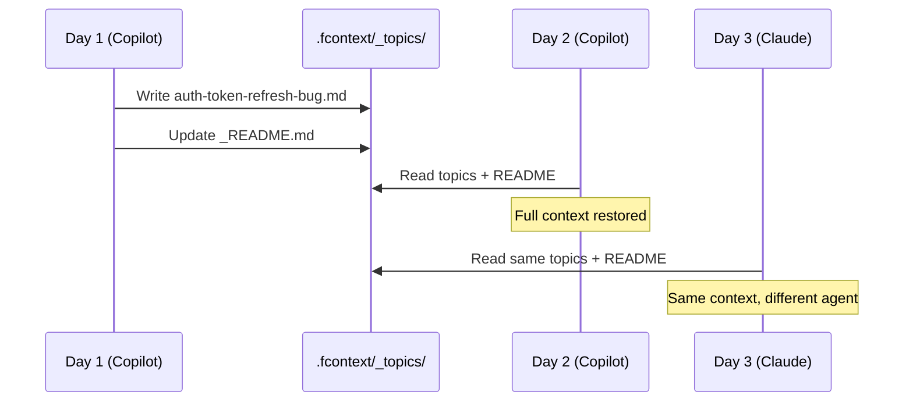

# Demo: Cross-Session Context Memory

> You're building a React app. Yesterday you spent 2 hours debugging an auth token refresh issue with Copilot. Today you open a new session — will the AI remember?

---

## Scenario Setup

```bash
# You have a React + Node.js project
cd my-react-app
fcontext init
fcontext enable copilot
```

## Day 1 — Debugging Session

You ask Copilot to help debug a token refresh loop. After 2 hours of investigation, the AI discovers:

- The refresh token endpoint returns a new access token but the client stores it in the wrong key
- There's a race condition when two API calls trigger refresh simultaneously
- The fix: add a mutex lock + fix the storage key

The AI writes its findings to `.fcontext/_topics/`:

```
.fcontext/_topics/
  auth-token-refresh-bug.md
```

Inside `auth-token-refresh-bug.md`:

```markdown
# Auth Token Refresh Bug — Root Cause Analysis

## Problem
Token refresh loop caused by two issues:
1. Client stores refreshed token in `sessionStorage.token` 
   but reads from `sessionStorage.access_token`
2. Race condition: concurrent API calls each trigger 
   independent refresh, overwriting each other

## Fix Applied
- Added refresh mutex in `src/auth/tokenManager.ts`
- Fixed storage key to `access_token` consistently
- Added 5s debounce on refresh trigger

## Files Changed
- src/auth/tokenManager.ts (mutex + key fix)
- src/api/client.ts (debounce)
```

## Day 2 — New Session

You open VS Code the next morning. **New session, clean slate — except it isn't.**

The AI reads `.fcontext/_topics/auth-token-refresh-bug.md` on startup.

You ask:

> "Is there anything else related to the token refresh that we should test?"

The AI immediately responds with edge cases — because it remembers the mutex, the race condition, and the exact files involved. **No re-explanation needed.**

## Day 3 — Switch to Claude Code

You want to try Claude Code for a different perspective:

```bash
fcontext enable claude
```

Claude reads the same `.fcontext/_topics/` and instantly knows about the auth fix, the mutex pattern, and the file locations. You ask:

> "Can you review the token refresh fix for potential edge cases?"

Claude reviews `src/auth/tokenManager.ts` with full knowledge of _why_ the mutex was added.

---

## What Made This Work



**Key takeaway:** The AI wrote one topic file during debugging. That file persisted across sessions and agents — turning a 2-hour debugging session into permanent project knowledge.

---

## Try It Yourself

```bash
pip install fcontext
cd your-project
fcontext init
fcontext enable copilot   # or your preferred agent

# Start working — the AI will create topics automatically
# Come back tomorrow — context is preserved
```
