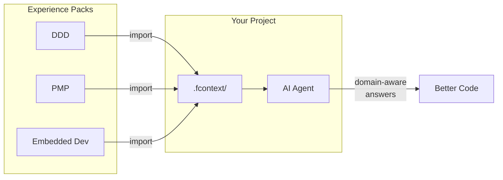

# Demo: AI-Powered Domain Learning

> You want to learn Domain-Driven Design and apply it to your project. Instead of reading 500 pages alone, you import an experience pack and learn interactively with AI.

---

## Scenario Setup

You're building a microservices e-commerce platform. You've heard DDD is the right approach but haven't studied it deeply.

```bash
cd my-ecommerce
fcontext init
fcontext enable claude
```

## Step 1 — Import DDD Knowledge

```bash
fcontext experience import git@github.com:lijma/fcontext-domain-driven-design.git
```

Now your `.fcontext/` looks like:

```
.fcontext/
├── _README.md
├── _workspace.map
└── _experiences/
    └── fcontext-domain-driven-design/
        ├── _README.md           # DDD overview, key concepts
        ├── _cache/
        │   └── ddd-reference.pdf.md   # Evans' patterns indexed
        └── _topics/
            ├── bounded-contexts.md
            ├── aggregate-design.md
            ├── domain-events.md
            └── context-mapping.md
```

## Step 2 — Interactive Learning

You ask Claude:

> "I have an e-commerce system with orders, payments, and inventory. How should I define bounded contexts?"

Claude reads the DDD experience pack and your project code, then responds with **specific recommendations for your codebase** — not generic textbook answers:

```
Based on your project structure and DDD bounded context patterns:

Suggested Bounded Contexts:
1. Order Context — order lifecycle, cart, checkout
   → src/services/order/
2. Payment Context — charge, refund, ledger
   → src/services/payment/
3. Inventory Context — stock, reservation, warehouse
   → src/services/inventory/

Anti-corruption layer needed between Payment ↔ Order
(your current code calls Stripe directly from OrderService — 
this should go through a PaymentGateway port)
```

## Step 3 — Apply Patterns to Real Code

You ask:

> "Help me refactor OrderService to use the Aggregate pattern"

Claude knows DDD aggregate rules from the experience pack **and** knows your codebase from `.fcontext/_README.md`. It generates a refactoring plan that fits both.

## Step 4 — Accumulate Your Own Knowledge

As you work, Claude writes project-specific DDD decisions to `_topics/`:

```
.fcontext/_topics/
  bounded-context-decisions.md    # Why we split Order vs Payment
  aggregate-boundaries.md         # Order aggregate includes OrderLines
  event-flow-design.md            # Domain events between contexts
```

Now your project has **both** general DDD knowledge (experience pack) **and** project-specific DDD decisions (topics). Next session, next agent — all of it is available.

---

## Also Works With Other Domains

```bash
# Learn project management
fcontext experience import git@github.com:lijma/fcontext-pmp-course.git
# → AI helps you create WBS, manage risks, track milestones using PMP methodology

# Learn embedded development
fcontext experience import git@github.com:lijma/fcontext-embed-development-course.git
# → AI understands hardware constraints, RTOS patterns, memory management
```



---

## Try It Yourself

```bash
pip install fcontext
cd your-project
fcontext init
fcontext enable copilot

# Pick an experience pack
fcontext experience import git@github.com:lijma/fcontext-domain-driven-design.git

# Start asking domain questions — the AI has the knowledge
# Your project-specific decisions accumulate automatically
```
