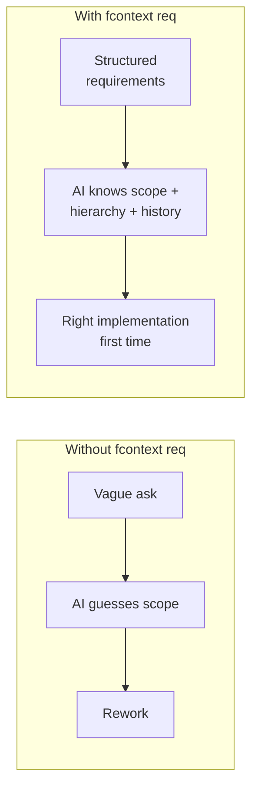

# Demo: Requirements-Driven Development

> You're building a feature from scratch. Instead of jumping into code, you define requirements first — then the AI implements with full context of what needs to be built and why.

---

## Scenario Setup

You're adding a notification system to your SaaS app.

```bash
cd my-saas-app
fcontext init
fcontext enable copilot
```

## Step 1 — Define the Requirement Hierarchy

```bash
# High-level epic
fcontext req add "Notification System" -t epic

# Break into stories
fcontext req add "Email notifications for account events" -t story --parent EPIC-001
fcontext req add "In-app notification center" -t story --parent EPIC-001
fcontext req add "Notification preferences page" -t story --parent EPIC-001

# Break a story into tasks
fcontext req add "SendGrid integration" -t task --parent STORY-001
fcontext req add "Welcome email template" -t task --parent STORY-001
fcontext req add "Password reset email" -t task --parent STORY-001
```

View the hierarchy:

```bash
fcontext req tree
```
```
EPIC-001  Notification System
├── STORY-001  Email notifications for account events
│   ├── TASK-001  SendGrid integration
│   ├── TASK-002  Welcome email template
│   └── TASK-003  Password reset email
├── STORY-002  In-app notification center
└── STORY-003  Notification preferences page
```

## Step 2 — AI Implements With Context

You start working on TASK-001:

```bash
fcontext req set TASK-001 status in-progress
```

You ask the AI:

> "Implement the SendGrid integration for TASK-001"

The AI reads `_requirements/TASK-001.yaml` and knows:

- This task belongs to STORY-001 (email notifications)
- Which belongs to EPIC-001 (notification system)
- Sibling tasks include email templates (so the integration needs to support template rendering)
- There are 3 stories total (so the integration should be generic enough for in-app notifications later)

**It generates a better implementation** because it understands the full scope, not just the isolated task.

## Step 3 — Track Progress

```bash
fcontext req set TASK-001 status done
fcontext req set TASK-002 status in-progress

fcontext req board
```
```
┌─────────────┬─────────────┬───────────┐
│   Backlog   │ In Progress │   Done    │
├─────────────┼─────────────┼───────────┤
│ TASK-003    │ TASK-002    │ TASK-001  │
│ STORY-002   │             │           │
│ STORY-003   │             │           │
└─────────────┴─────────────┴───────────┘
```

## Step 4 — Requirements Evolve

After launch, users want SMS notifications too. Requirements evolve:

```bash
fcontext req add "SMS + Email notifications for account events" -t story
fcontext req link STORY-004 supersedes STORY-001

# See the evolution
fcontext req trace STORY-004
```
```
STORY-001  Email notifications for account events
  └── superseded by → STORY-004  SMS + Email notifications for account events
```

The AI sees this evolution chain and understands: STORY-004 extends the original email-only scope to include SMS. When implementing, it knows to **keep the existing email code and add SMS alongside it**, not replace.

---

## Why This Matters



**Key takeaway:** The AI doesn't just implement what you say — it implements what you say **in the context of** the full requirement tree, sibling tasks, parent stories, and evolution history.

---

## Try It Yourself

```bash
pip install fcontext
cd your-project
fcontext init
fcontext enable copilot

# Define your feature
fcontext req add "My Feature" -t epic
fcontext req add "First story" -t story --parent EPIC-001

# Start implementing — the AI reads requirements automatically
```
