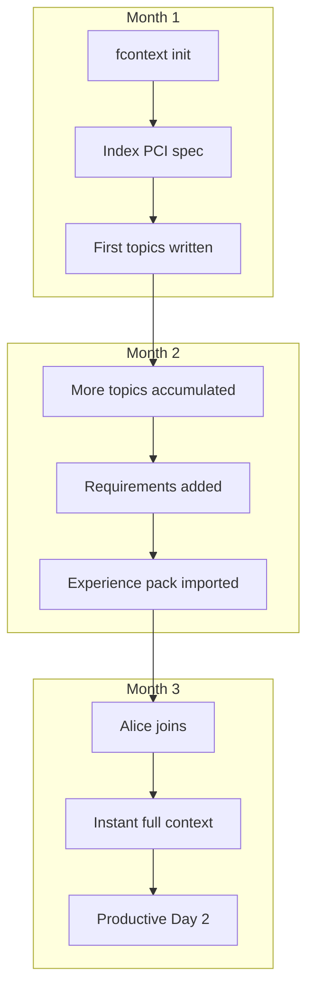

# Demo: Team Knowledge Onboarding

> A new developer joins your team. Instead of spending 2 weeks reading docs and asking questions, their AI agent understands the project from minute one.

---

## Scenario Setup

Your team has a payment processing service. Senior developers have been working on it for months with fcontext enabled. The `.fcontext/` directory is committed to Git.

```
.fcontext/
├── _README.md                  # "This is a payment gateway service using 
│                               #  Stripe API with idempotency keys..."
├── _workspace.map              # Project structure overview
├── _cache/
│   ├── docs/
│   │   └── stripe-integration.pdf.md    # Indexed Stripe contract
│   └── specs/
│       └── pci-compliance.docx.md       # PCI requirements
├── _topics/
│   ├── idempotency-pattern.md           # Why we use idempotency keys
│   ├── retry-strategy.md               # Exponential backoff decisions
│   └── currency-rounding.md            # Currency precision rules
├── _requirements/
│   ├── EPIC-001.yaml                    # Payment flow
│   ├── STORY-003.yaml                  # Refund handling
│   └── TASK-012.yaml                   # Add JPY support (in-progress)
└── _experiences/
    └── payment-domain/                  # Imported: payment industry knowledge
        ├── _README.md
        ├── _cache/
        └── _topics/
```

## New Developer — Day 1

Alice joins the team. She clones the repo:

```bash
git clone git@github.com:your-org/payment-service.git
cd payment-service
fcontext enable cursor    # Alice uses Cursor
```

Alice opens Cursor and asks:

> "What is this project and how is it structured?"

Cursor reads `.fcontext/_README.md` and `_workspace.map`, and responds with a precise overview — architecture, key modules, API patterns, and current work items. **No senior dev needed for the intro.**

## Day 1 — Understanding Domain Rules

Alice asks:

> "Why do we use idempotency keys on every payment request?"

Cursor reads `.fcontext/_topics/idempotency-pattern.md` and explains the exact reasoning — network retries, duplicate charge prevention, the specific Stripe API behavior. Knowledge that took the team weeks to formalize is available instantly.

## Day 1 — Reading Specs

Alice asks:

> "What are our PCI compliance requirements?"

Cursor reads `.fcontext/_cache/specs/pci-compliance.docx.md` — the original DOCX was indexed by a senior dev months ago. Alice gets the full spec without hunting for the document.

## Day 2 — First Task

Alice picks up TASK-012 (Add JPY support). She asks:

> "What's the current status of JPY support and what do I need to know?"

Cursor reads:

- `_requirements/TASK-012.yaml` — task details, parent story, acceptance criteria
- `_topics/currency-rounding.md` — why JPY has no decimal places (¥100, not ¥1.00)
- `_experiences/payment-domain/` — general payment industry rules about currency handling

Alice writes the implementation. Cursor guides her based on existing patterns and domain knowledge. **She's productive on Day 2, not Week 2.**

---

## How the Team Built This Context

It wasn't a one-time effort. The context **accumulated naturally** over months:



Each developer's AI sessions **added knowledge** to `.fcontext/`. By the time Alice joined, the context was rich and comprehensive — not because someone wrote documentation, but because the AI captured knowledge as a side effect of daily work.

---

## Try It Yourself

```bash
# Senior dev: set up context
cd your-project
fcontext init
fcontext enable copilot
fcontext index docs/        # Index existing documents

# Work normally — AI accumulates knowledge in _topics/

# When ready to share:
git add .fcontext/
git commit -m "project context"
git push

# New member:
git clone your-project.git
fcontext enable cursor     # Their preferred agent
# Done — instant onboarding
```
