# Features

## Overview

```mermaid
graph TD
    FC[".fcontext/"]
    FC --> MA["🤖 Multi-Agent<br/>Support"]
    FC --> DI["📄 Document<br/>Indexing"]
    FC --> DC["🧠 Dynamic Context<br/>Building"]
    FC --> EP["📦 Experience<br/>Packs"]
    FC --> RM["📋 Requirements<br/>Management"]
    FC --> WM["🗺️ Workspace<br/>Map"]
    FC --> LS["📝 Living<br/>Summary"]
    FC --> OS["🔒 Offline &<br/>Secure"]
```



---

## Multi-Agent Support

fcontext generates instructions in each agent's **native format**. Enable any agent with one command:

```bash
fcontext enable copilot    # .github/instructions/*.instructions.md
fcontext enable claude     # .claude/rules/*.md
fcontext enable cursor     # .cursor/rules/*.md
fcontext enable trae       # .trae/rules/*.md
fcontext enable opencode   # uses Claude format
fcontext enable openclaw   # skills/ only
```

All agents share the same `.fcontext/` data — switch freely without losing context.

---

## Document Indexing

Convert binary files to Markdown so any AI agent can read them:

```bash
fcontext index specs/requirements.pdf
fcontext index contracts/
fcontext index docs/architecture.docx
```

### Supported formats

| Category | Formats |
|----------|---------|
| Documents | PDF, DOCX, XLSX, PPTX, RTF, ODT, EPUB |
| Presentations | Keynote, PowerPoint |
| Text | Markdown, TXT, RST, AsciiDoc (direct copy) |
| Diagrams | Excalidraw, Draw.io |

Converted files are cached in `.fcontext/_cache/` with source tracking. Incremental — only re-converts when source files change.

---

## Dynamic Context Building

AI agents write conclusions and discoveries to `_topics/` during sessions:

```
.fcontext/_topics/
  debugging-auth-flow.md       # Yesterday's debugging session
  architecture-decisions.md    # Key design choices
  api-integration-notes.md     # Third-party API findings
```

The next session automatically reads these files, continuing where the last session left off.

!!! tip "How topics work"
    Topics are plain Markdown files. The AI creates them when it reaches important conclusions. You can also write them manually. Use `fcontext topic list` to see what's accumulated.

---

## Experience Packs

Package and share domain knowledge across projects and teams:

```bash
# Export your project knowledge
fcontext export team-knowledge.zip
fcontext export git@github.com:team/domain-knowledge.git

# Import into another project
fcontext experience import team-knowledge.zip
fcontext experience import git@github.com:team/domain-knowledge.git

# Keep packs up-to-date
fcontext experience update
```

An experience pack contains `_README.md`, `_cache/`, `_topics/`, and `_requirements/` — everything an AI needs to understand a domain.

### Real-world experience packs

| Pack | Description | Source |
|------|-------------|--------|
| [fcontext-pmp-course](https://github.com/lijma/fcontext-pmp-course) | Learn project management with AI | `fcontext experience import` |
| [fcontext-embed-development-course](https://github.com/lijma/fcontext-embed-development-course) | Learn embedded development with AI | `fcontext experience import` |
| [fcontext-domain-driven-design](https://github.com/lijma/fcontext-domain-driven-design) | Learn DDD with AI | `fcontext experience import` |

---

## Requirements Management

Track requirements, stories, tasks, and bugs with full evolution history:

```bash
fcontext req add "User authentication via OAuth" -t story
fcontext req add "Support Google provider" -t task --parent STORY-001
fcontext req set TASK-001 status in-progress
fcontext req board    # Kanban view
fcontext req tree     # Hierarchy view
```


Requirements support **evolution tracking** — when requirements change, link the new version to the old one:

```bash
fcontext req add "OAuth with PKCE flow" -t story
fcontext req link STORY-003 supersedes STORY-001
fcontext req trace STORY-003   # see full history
```

---

## Workspace Map

Auto-generated project structure overview in `.fcontext/_workspace.map`:

```bash
fcontext init    # generates workspace map automatically
```

The map gives AI agents an instant understanding of project layout without scanning every file.

---

## Living Project Summary

`.fcontext/_README.md` is the first file every AI session reads. The AI **maintains it automatically** — updating it when it learns something significant about the project.

This creates a living document that captures:

- Project purpose and domain
- Architecture overview
- Key conventions and patterns
- Known pitfalls and decisions

---

## Offline & Secure

- **All data local** — stored in `.fcontext/` directory
- **No cloud dependency** — works without internet
- **No API keys required** — fcontext itself needs no external services
- **No telemetry** — zero data collection
- **Git-friendly** — `.fcontext/` is designed to be version-controlled
