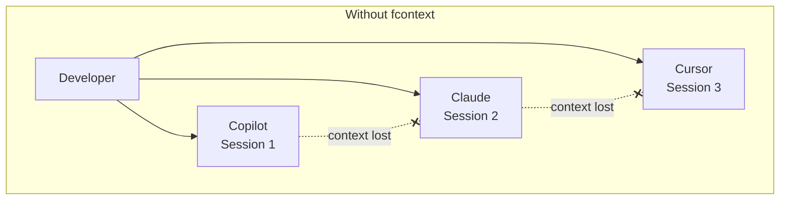
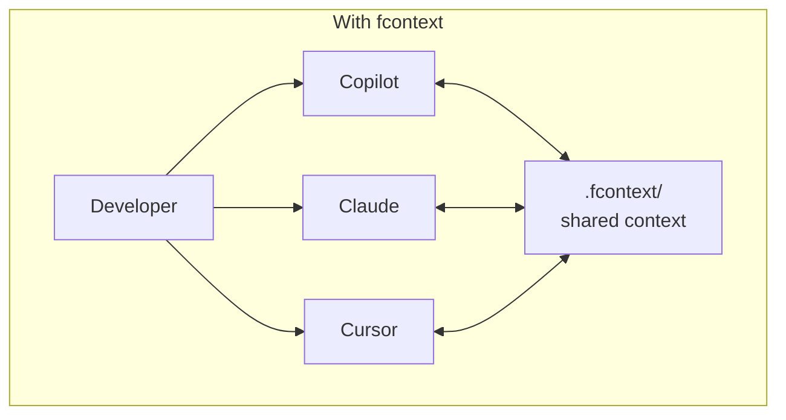
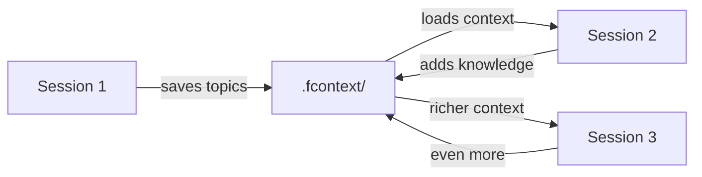
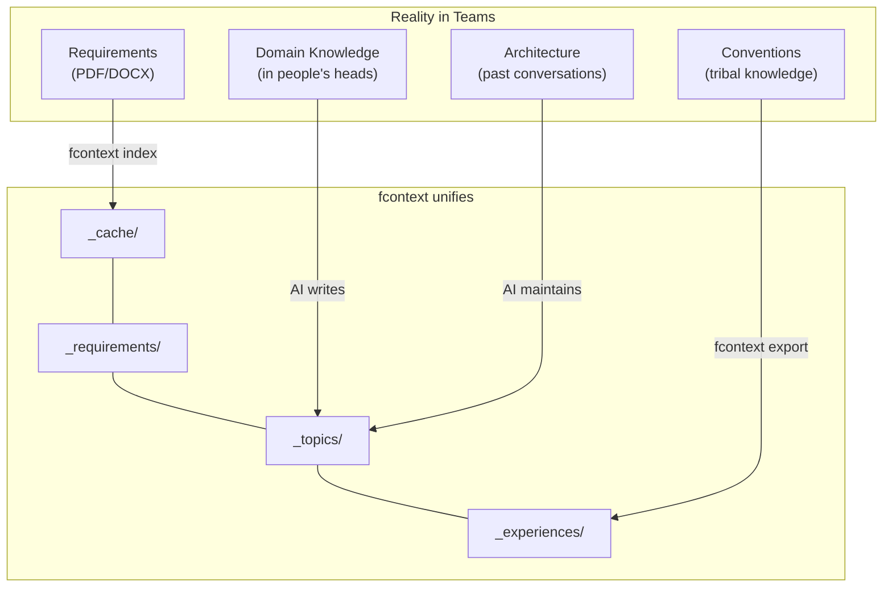
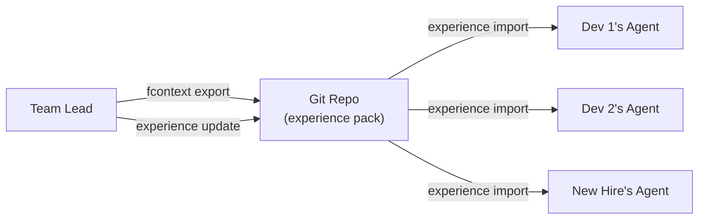

# fcontext

**Context continuity across AI agents & sessions.**

<a href="https://www.producthunt.com/products/fcontext/reviews/new?utm_source=badge-product_review&utm_medium=badge&utm_source=badge-fcontext" target="_blank"></a>

---

| | |
|---|---|
| 🔄 **Cross-Agent, Cross-Session** | 👥 **Team Collaboration** |
| Switch between Copilot, Claude, Cursor, Trae — your AI never starts from zero. | Export/import experience packs. Every team member's agent shares the same domain knowledge. |
| 🛡️ **Industrial-Grade Delivery** | 🔒 **Offline & Secure** |
| Structured context + requirements tracking + document indexing = consistent, auditable output. | All data local in `.fcontext/`. No cloud. No API keys. No telemetry. |

---

## The Core Problem

AI coding agents are powerful — but they have three critical blind spots:

1. **Session amnesia** — Every new conversation starts from zero
2. **Agent isolation** — Switch agents, lose all context
3. **Team fragmentation** — Each team member's AI works in a silo





---

## For Individuals

> **AI delivers results, but you deliver process and experience.**

Your expertise — how you approach problems, what patterns you've learned, what pitfalls to avoid — is lost every time a session ends.

fcontext captures and persists that experience:

| What you lose today | What fcontext preserves |
|---------------------|------------------------|
| Debugging conclusions from yesterday | `_topics/debugging-auth-flow.md` |
| Architecture decisions across sessions | `_README.md` (AI-maintained) |
| Document analysis results | `_cache/` (indexed, reusable) |
| Project-specific patterns | `_experiences/` (exportable) |

### Your AI gets smarter over time



Each session **builds on** the previous one. Your AI accumulates understanding instead of starting from scratch.

---

## For Teams & Enterprises

> **No single agent has all the context to do the job. Real work is distributed.**

In production environments, context is fragmented across people, documents, and conversations:



### Key benefits for enterprises

| Concern | How fcontext addresses it |
|---------|--------------------------|
| **Onboarding** | New member imports experience pack → instant project knowledge |
| **Consistency** | All agents read the same structured context → uniform output |
| **Traceability** | Requirements tracked with evolution history → auditable decisions |
| **Compliance** | All data stored locally, no cloud dependency → security-first |
| **Knowledge retention** | Team expertise persists in `_topics/` and `_experiences/` → survives attrition |

### Team knowledge flow



---

## Quick Start

```bash
pip install fcontext

cd your-project
fcontext init
fcontext enable copilot    # or: claude, cursor, trae, opencode
fcontext index docs/
```

Your AI agent now reads project context automatically on every session.

---

## Supported Agents

| Agent | Command |
|-------|---------|
| GitHub Copilot | `fcontext enable copilot` |
| Claude Code | `fcontext enable claude` |
| Cursor | `fcontext enable cursor` |
| Trae | `fcontext enable trae` |
| OpenCode | `fcontext enable opencode` |
| OpenClaw | `fcontext enable openclaw` |

---

## Links

- [PyPI Package](https://pypi.org/project/fcontext/)
- [GitHub Repository](https://github.com/lijma/agent-skill-fcontext)
