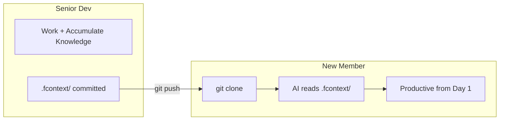
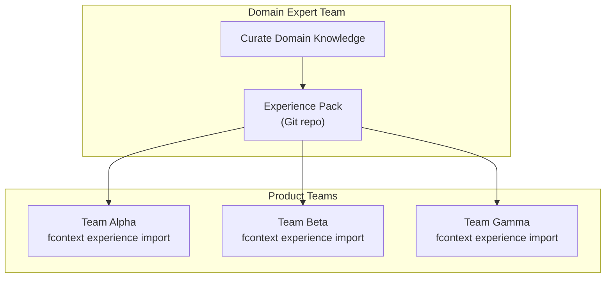

# For Enterprises

## Onboard New Team Members in Minutes

**Problem:** A new developer joins. It takes weeks to understand the codebase, architecture decisions, and domain knowledge. AI agents start from zero for every new team member.

**Solution:** Commit `.fcontext/` to your repo. New members get instant context:

```bash
git clone your-project.git
cd your-project

# .fcontext/ is already there — AI reads it automatically
# New developer's AI immediately understands:
#   - Project architecture and conventions
#   - Key decisions and their rationale
#   - Domain-specific knowledge
#   - Current requirements and progress
```



---

## Share Domain Knowledge Across Projects

**Problem:** Your organization has domain expertise scattered across teams. Each project reinvents understanding of the same domain concepts.

**Solution:** Create and distribute experience packs:

```bash
# Team A: Export domain knowledge
cd project-a
fcontext export git@github.com:your-org/payment-domain.git

# Team B, C, D: Import the same knowledge
cd project-b
fcontext experience import git@github.com:your-org/payment-domain.git

# When domain knowledge evolves
fcontext experience update
```



### Example: organization-wide packs

| Pack | Purpose | Teams |
|------|---------|-------|
| `payment-domain` | Payment processing rules, compliance | Checkout, Billing, Finance |
| `security-standards` | Security patterns, audit requirements | All engineering teams |
| `api-conventions` | API design standards, error handling | Backend teams |

---

## Standardize AI Delivery Quality

**Problem:** Different developers get different quality from AI agents. No consistent standard for AI-assisted development.

**Solution:** fcontext instructions enforce consistent AI behavior:

- AI always reads project context before answering
- AI always checks requirements before implementing
- AI always persists discoveries for future sessions
- AI never modifies imported experience packs
- AI uses structured format for requirements and topics

These rules are embedded in the generated instruction files for every agent. Every developer, regardless of experience, gets the same high-quality AI behavior.

---

## Security & Compliance

| Concern | fcontext approach |
|---------|-------------------|
| **Data residency** | All data in local `.fcontext/` directory — no cloud upload |
| **Sensitive documents** | Indexed files stay on-disk, never sent to external services |
| **Audit trail** | Requirements track author, source, creation time, status changes |
| **Access control** | Standard Git permissions apply to `.fcontext/` |
| **No vendor lock-in** | Plain Markdown/YAML files, no proprietary format |
