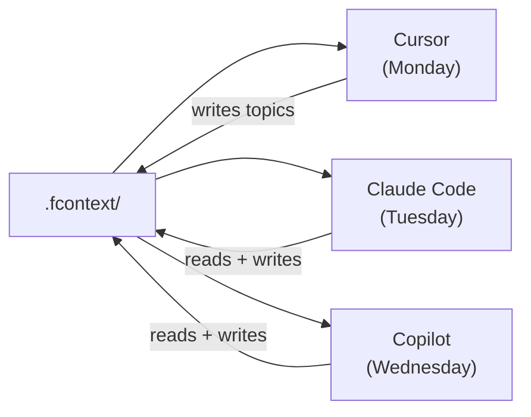

# For Individuals

## Resume Any Session Instantly

**Problem:** You close VS Code, come back tomorrow — the AI has no memory of yesterday's progress.

**Solution:** fcontext persists session knowledge in `_topics/`:

```bash
# Yesterday: AI discovered a tricky auth bug
# Today: just start a new session

$ fcontext topic list
  auth-token-refresh-bug.md    2025-01-15 18:30
  api-rate-limit-workaround.md 2025-01-14 09:12

# The AI reads these automatically and continues where you left off
```

---

## Switch Between AI Agents Freely

**Problem:** You used Cursor yesterday but want to try Claude Code today. All context is locked in Cursor's format.

**Solution:** Enable multiple agents — they all share the same `.fcontext/` data:

```bash
fcontext enable cursor
fcontext enable claude

# Both agents now read from the same .fcontext/ directory
# Switch freely without losing any context
```



---

## Read Any Document Format

**Problem:** Your project has PDF specs, DOCX contracts, XLSX data — AI agents can't read binary files.

**Solution:** Index them once:

```bash
fcontext index specs/
fcontext index contracts/agreement.pdf
```

Now every AI agent can read the converted Markdown in `.fcontext/_cache/`. Ask the AI about your PDF requirements or DOCX specifications directly.

---

## Track Requirements Without External Tools

**Problem:** Requirements live in Jira / Notion / scattered docs. The AI doesn't know what you're building.

**Solution:** Keep requirements next to code:

```bash
fcontext req add "Implement OAuth login" -t story
fcontext req add "Support Google provider" -t task --parent STORY-001
fcontext req set TASK-001 status done

fcontext req board
# ┌─────────┬─────────────┬──────────┐
# │ Backlog │ In Progress │   Done   │
# ├─────────┼─────────────┼──────────┤
# │         │ STORY-001   │ TASK-001 │
# └─────────┴─────────────┴──────────┘
```

The AI reads `_requirements/` and understands what needs to be built, what's in progress, and what's done.

---

## Learn a New Domain with AI

**Problem:** You're starting a new project in an unfamiliar domain — embedded development, project management, DDD. The AI only knows generic patterns.

**Solution:** Import an experience pack:

```bash
# Import domain expertise
fcontext experience import git@github.com:lijma/fcontext-pmp-course.git
fcontext experience import git@github.com:lijma/fcontext-embed-development-course.git

# Now the AI understands PMP methodology and embedded dev patterns
# Ask it domain-specific questions — it has the knowledge
```

### Available experience packs

| Pack | What the AI learns |
|------|-------------------|
| [fcontext-pmp-course](https://github.com/lijma/fcontext-pmp-course) | Project management (PMP) methodology, processes, knowledge areas |
| [fcontext-embed-development-course](https://github.com/lijma/fcontext-embed-development-course) | Embedded systems development, hardware-software integration |
| [fcontext-domain-driven-design](https://github.com/lijma/fcontext-domain-driven-design) | DDD patterns, bounded contexts, aggregate design |
